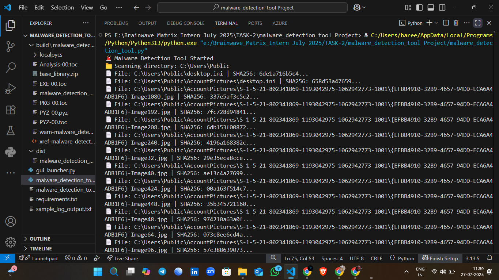
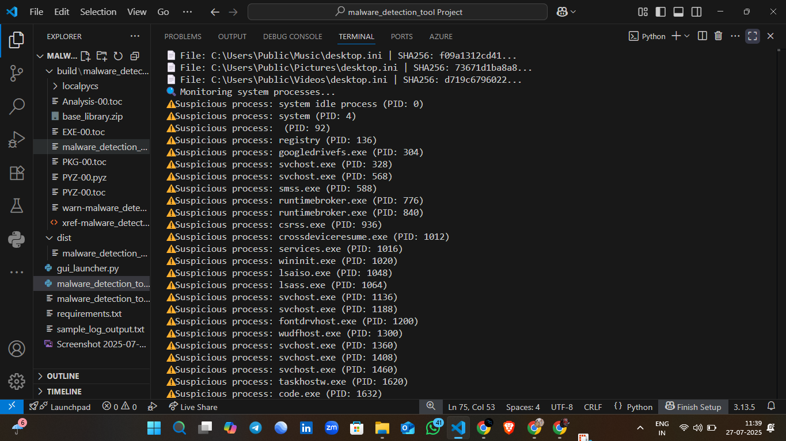
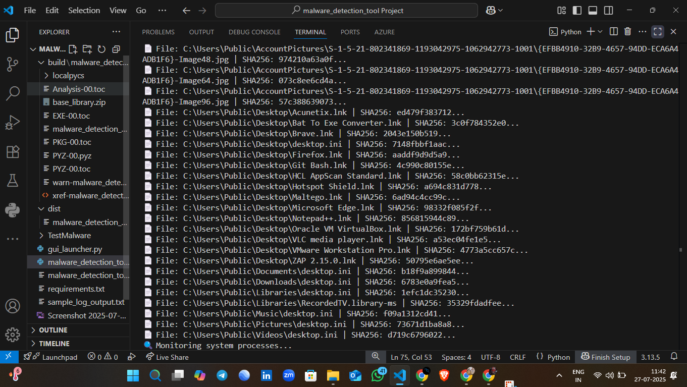

<h1 align="center">
🛡️ Malware Detection Tool<br>
<sub><strong>Built for Brainwave Matrix Internship - Task 2</strong></sub>
</h1>

<p align="center">
  
  
  
</p>

<p align="center">
  
</p>

---

## 🎯 Project Overview

This is a **Malware Detection Tool** built using **Python**, developed during my internship at **Brainwave Matrix Solutions**.

The tool performs the following:

- 🔍 Scans system directories for suspicious files using SHA256
- 🧠 Monitors running processes to detect potentially malicious behavior
- 📄 Logs suspicious activity for review and audit

---

## 🌟 Features

| Feature                        | Description                                 |
|-------------------------------|---------------------------------------------|
| 🛡️ Real-time Detection        | Scans processes and files in real-time      |
| ⚙️ Auto-scan                  | Scans every 30 seconds automatically        |
| 🧠 SHA256 Hash Comparison     | Verifies files using secure hashes          |
| 📜 Terminal Logging           | Clean output in terminal with status icons  |
| 💾 Lightweight Script         | No heavy dependencies                       |

---

## 💻 Tech Stack

| Tool/Library     | Purpose                       |
|------------------|-------------------------------|
| `Python 3.x`     | Core language                 |
| `psutil`         | Process monitoring            |
| `hashlib`        | SHA256 hashing                |
| `os`, `time`     | Directory scan & timing       |

---

## 🎬 Screenshots

### 🔍 File Scanning in Action



---

### ⚠️ Suspicious Processes Identified



---

### 🧾 File Hash Results & Shortcuts



---

## ⚙️ How to Run

```bash
# Clone the repo
git clone https://github.com/HareeshKumar/malware_detection_tool.git

# Move into directory
cd malware_detection_tool

# Run the main script
python malware_detection_tool.py
